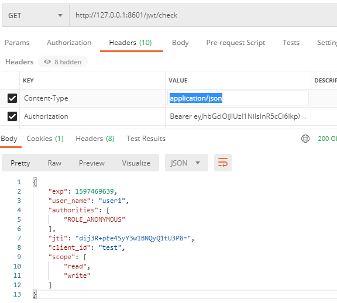

# springsecurity-oauth2
springsecurity-oauth2集成，jwt生成token

## 本地部署调试
 环境准备：mysql5+,jdk8+
 - 1.先执行sql语句，oauth2使用的表;
 - 2.目前支持password+jwt生成token;
 - 3.可以反解析jwt内容;
 - 4.获取token:http://127.0.0.1:8601/oauth/token?username=user1&password=123456&type=password&client_id=test&client_secret=test1234&grant_type=password
 - 5.反解析token:http://127.0.0.1:8601/jwt/check ;
    header配置Content-Type:application/json; Authorization:上一步获取的access_token值

## sql脚本
````SQL
springsecurity-oauth2\src\main\resources\oauth2.sql
````